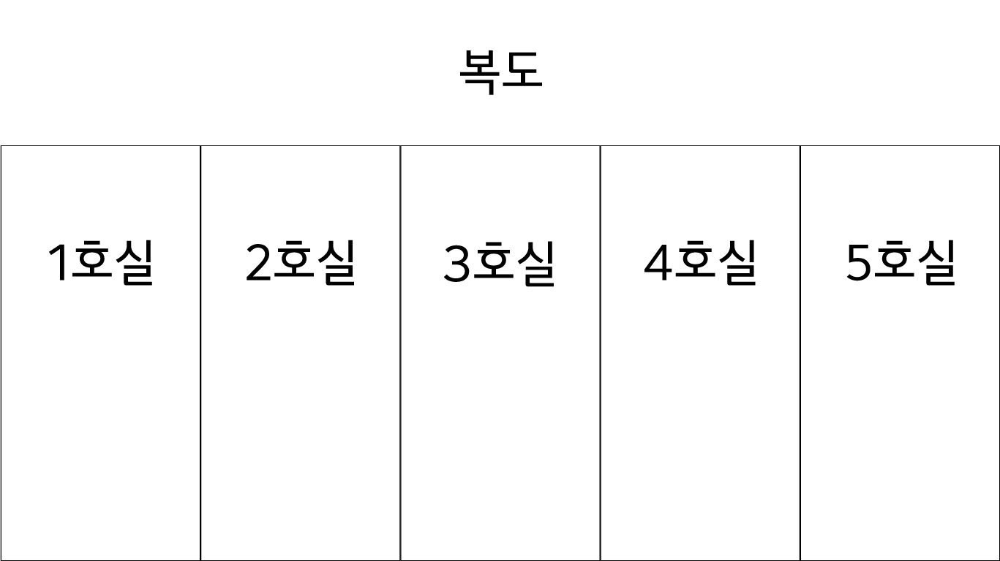

# 미치광이 과학자에 의해 방에 갇힌 건에 대하여
### 문제 내용
어느날 미치광이 과학자가 도훈, 희영, 재남, 준민, 수연을 납치하여 1호실부터 5호실까지의 5개 방 안에 한 명씩 가뒀다. 각자가 상황을 파악하던 그때, 방 안의 스피커에서 다음과 같은 말이 > 들렸다. 
> 너희는 서로 다른 5개의 방에 갇혔다. 각자가 몇 번 방에 있는지는 확인할 수 있을 것이다. 추가적으로,
> * 도훈과 희영은 이웃한 방에 있다.
> * 도훈과 재남은 이웃한 방에 있지 않다.
> * 도훈과 준민은 이웃한 방에 있지 않다.
> * 재남은 준민보다 왼쪽 방에 있다.
> 
> 5명이 각자 어느 방에 있는지 2명 이상이 맞히면 너희를 풀어주도록 하겠다. 굿럭.

각자는 자신이 몇 호실에 있는지는 알 수 있었으나, 주어진 조건만으로는 다른 사람들이 몇 호실에 있는지 알 턱이 없었다. 불행 중 다행인지, **복도를 통해 서로 의 목소리를 들을 수는 있었다. 하지만, 이 5명은 오늘 처음 만난 사람들인지라, 각자의 목소리를 구분할 수는 없었다**. 

이런 절망적인 상황 속에서 모두가 답을 모르겠다고 소리쳤다. 조금의 시간이 지나고 다시 한 번 모두가 답을 모르겠다고 소리쳤다. 모두가 포기하려던 찰나, 한 명이 정답을 알겠다고 소리쳤고, 정답을 맞췄다. 이후, 또 다른 한 명이 정답을 맞췄고, 5명은 미치광이 과학자로부터 풀려날 수 있었다. **정답을 맞춘 2명은 누구이며, 그 순서는 어떻게 되겠는가?** 아래는 방의 배치도다.

